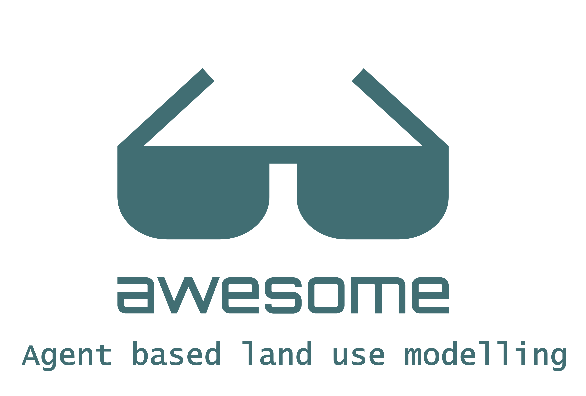

<!--lint disable double-link-->

<!--lint ignore no-dead-urls-->

#  

A curated list of the best resources related to Agent-based modelling of land use the internet has to offer.

---

Contributions of any kind are welcome, just follow the [guidelines](.github/CONTRIBUTING.md) by either:

- Filling a [suggestion issue](https://github.com/mcanouil/awesome-quarto/issues/new?assignees=mcanouil&labels=&template=suggestion.yml) (easier).
- Opening a [pull request](https://github.com/mcanouil/awesome-quarto/compare).

---

## Contents

- [Featured (new entries)](#featured-new-entries)
- [Tutorials \& workshops](#tutorials--workshops)
- [Blog posts](#blog-posts)
- [Talks and videos](#talks-and-videos)

<!--lint disable awesome-list-item-->
<!--lint disable double-link-->

## Featured (new entries)

<!--lint enable awesome-list-item-->
<!--lint enable double-link-->

## Tutorials & workshops

## Blog posts

## Talks and videos

## Contributing

Thanks goes to these [contributors](https://github.com/mcanouil/awesome-quarto/graphs/contributors)!
